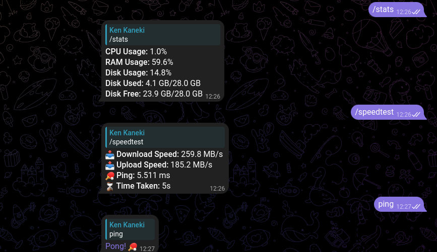
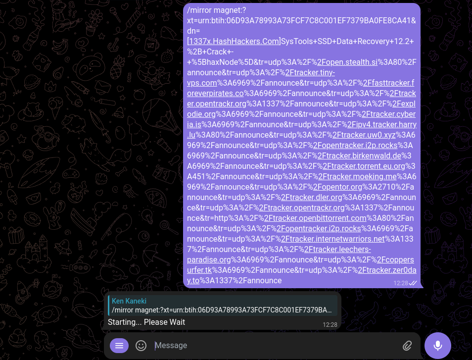
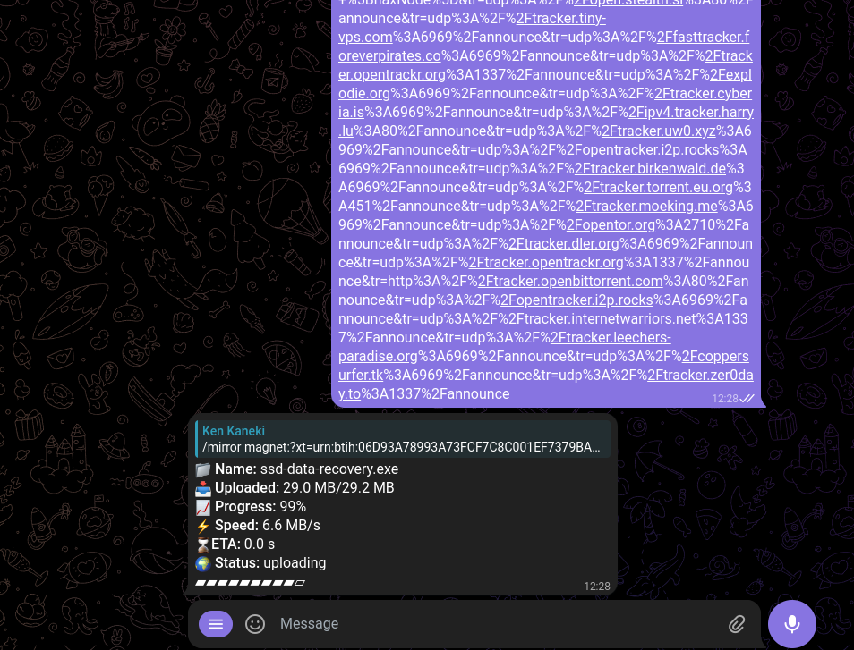
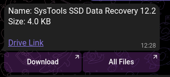

# Telegram Mirror Bot `BETA`

This is a Telegram bot built using Pyrogram that mirrors links/magnets to Google Drive. Downloads are handled by the famous aria2c. The bot also provides various commands for managing downloads and obtaining system stats.

## Screenshots
#### Stats


#### Starting the Mirror Process


#### Uploading Process


#### Final Verdict



## Features

- **/mirror** - Mirror a URL or magnet link.
- **/cancel** - Cancel the ongoing mirror process.
- **/stats** - Show system statistics.
- **/link** - Get a Gofile link for direct download.
- **/ping** - Ping the server.
- **/speedtest** - Perform a server speed test.

## To-Do
 1. ~~Feature to Cancel Uploads.~~
 2. Code Optimization.
 3. ~~Better Asynchronization.~~
 4. ~~Cleaner Bot UI.~~

## Configuration

To set up your bot, you need to modify the `config_sample.conf` file by renaming it to `config.conf` and filling in all the required details.

### Sample Configuration

```ini
# Visit "https://github.com/anasty17/mirror-leech-telegram-bot" for more details
[GOOGLE]
CLIENT_ID = 
CLIENT_SECRET = 
PROJECT_ID = <GCP PROJECT ID> 
USE_SERVICE_ACCOUNTS = false
USE_TEAM_DRIVE= false
TEAM_DRIVE_ID = 
GDRIVE_FOLDER_ID = 
# Dont touch below 2 variables
SCOPES = https://www.googleapis.com/auth/drive.file
ACCOUNTS_FOLDER = accounts   

#Get your creds from 'https://gofile.io/myProfile'
[GOFILE]
GO_API = 
GO_FOLDER_ID = 

# link to your drive index , visit "https://gitlab.com/GoogleDriveIndex/Google-Drive-Index" for details
[INDEX]
BASE_URL = 

[TG]
BOT_TOKEN = 
API_ID =  
API_HASH = 

```
## PREREQUISITE
- Obtain your `credentails.json` from GCP or generate them using modules/gentoken.py and place inside `json` folder.
- Before dpeloying on server, please firstly run on a local macine to obtain `token.json`.


## Deployment
You can easily deploy this project using Docker Compose. Follow these steps:
1. Build the Docker image:
    ```sh
    sudo docker compose build
    ```
1. Start the bot:
    ```sh
    sudo docker compose up
    ```    

## Contributions
This project is open to any contributions and suggestions. Feel free to fork the repository and submit pull requests.


## Acknowledgements
- Visit [This Repo](https://github.com/anasty17/mirror-leech-telegram-bot) for more details on the bot's implementation.

- Get your Gofile credentials from [Gofile Profile](https://gofile.io/)

- Link to your drive index using [Google Drive Index](https://gitlab.com/GoogleDriveIndex/Google-Drive-Index)

- Get you Telegram API from [HERE](https://my.telegram.org/auth)

- Get you Bot Token from [This BOT](https://web.telegram.org/k/#@BotFather)

## License
 - This project is licensed under the [MIT License](https://opensource.org/license/mit). See the [LICENSE](LICENSE) file for details.